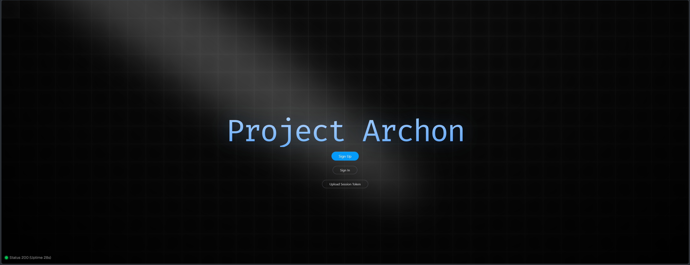
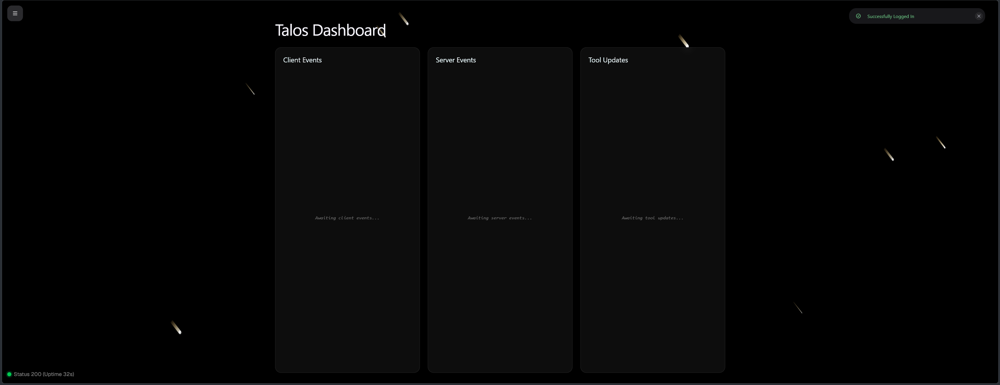
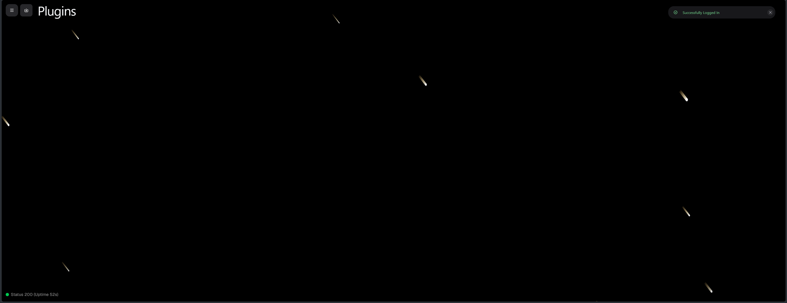
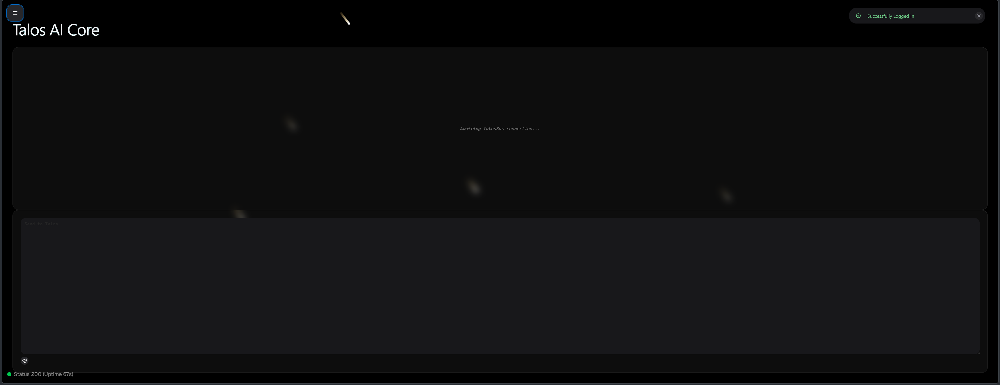
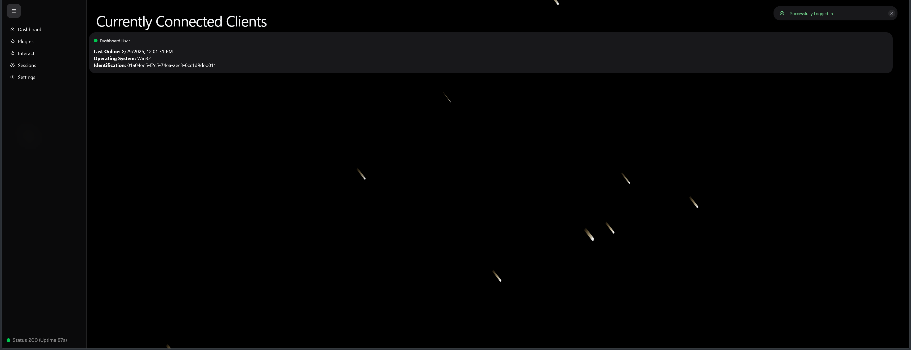

# Project Archon

## Project Description
Project Archon is designed to be a server application that allows a variety of backends to be used. By default it only comes with antigravity-cli support and gemini live API support. This is designed to be improved upon using plugins. The application is designed to be run using the server command on a server and then when the client command is run it allows the user to interact with the server. The user can also change most of the settings from the frontend. If this project gets big enough there might be a v2 that fixes some of the bugs and allows the user to change all of the settings directly from the frontend. But I do not have enough time to do that so I decided that everything should be left up to the plugins.

## Architecture
Project Archon uses multiple modularized crates to help organize the codebase. They all communicate with each other using enums in the core crate directory. This allows a developer to just go into a specific crate to fix some issues that they might be experiencing with something related to the crate, such as going into the auth crate if there is an issue with authentication.

## AI Usage
All of the react side used AI Guidance. I do not know why but the Antigravity-CLI counted towards my AI coding hours even when it was open in the background. I think it might have been counting my app as my app opens an antigravity-cli instance. All AI Usage has more detail in the commit messages. I used a lot of premade components most of my work was just wiring everything together to make it work. For me I consider AI guidance as when the AI does researching and returns a list of modules and docs I can use for my code allowing me to spend less untracked time researching.

## Install
To install this app you go to the [Releases Page](https://github.com/NMaster23/Project-Archon/releases) and download the installer. Do __not__ download the release marked as Non-User as that is what the installer fetches. If you are an advanced user you can download the application itself and deal with any issues caused by directory. Then you run the app with arguments detailing in the directory the app has been installed to. After the url is printed the user might need to wait for a few moments as it takes a bit for cloudflare to spin up.

#### Windows Directory:
```
C:\Users\<user>\AppData\Local\Talos
```

The shortcut also was placed on the Desktop.

### Arguments:
#### Server:
```
./talos server
```
#### Client:
```
./talos client <Server IP Address>
```

E.g.
```
./talos client 192.168.68.123
```

## Why
I decided to make this because I have been trying to get to learn more about systems like OpenClaw and Hermes and what makes them so complex. So I decided the best way to learn it for me would be by doing it. So I decided to make this project kind of like a competitor to those. This project is worse many ways because I am not a professional but it still does have things those do not have. Namely the plugin system which uses WebAssembly to minimize security risks in comparison to OpenClaw which just uses .md for only AI skills not the entire platform and has a very high risk with prompt injection. Also like Hermes this project does in fact have a self learning thing. This project also contains RAG and allows memories to be easily referenced when chatting.

## Usage
The server prints out the url at which the server can be accessed. Then once the user goes to the URL they can interact with the AI backend and they can also upload a session token from the client side instead of making an account. All of the accounts are stored locally and heavily encrypted so no one even with the file can access it and discover your password. Also again this is not professional grade so chat history in the UI is not stored and same for the Live API, but because one of the backends is antigravity that itself has its own chat history so the user can look through that if they need to.

## Build from Source
The instructions to build this entire app from source are as follows. The user must be familiar with using git and cargo. Rust must be installed and documentation on how can be found at: [Rust Lang Install Docs](https://rust-lang.org/tools/install/) . Then you must follow everything it says to install it. Then you must also install git which can be found at [Git Install](https://git-scm.com/install/) . After all of this you must run:
```
git clone https://github.com/NMaster23/Project-Archon.git
```
And then go into that directory. Then using cargo you run it using:
```
cargo run -p talos
```
or you can build it using:
```
cargo build -p talos
```

For the installer the commands are:
```
cargo run -p installer
```
and:
```
cargo build -p installer
```

## Dashboard Screenshot:





